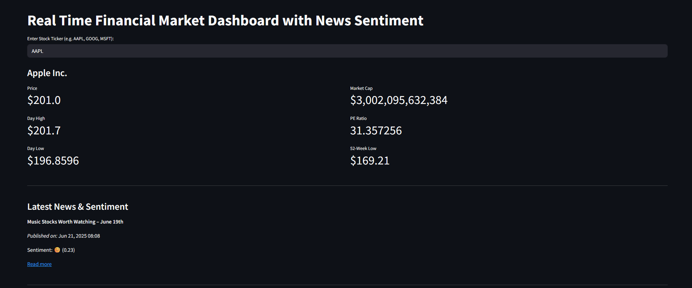
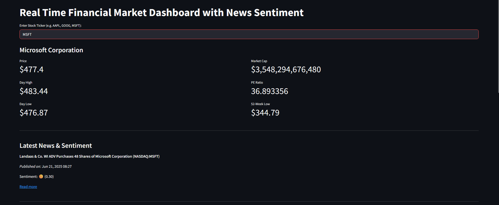

# Real-Time Financial Market Dashboard with News Sentiment

This Streamlit-powered dashboard combines real-time stock market data with intelligent sentiment analysis from recent news headlines. It’s like a mini Bloomberg Terminal built with Python!

---

## Features

- Real-time stock prices and financial indicators using `yfinance`
- Top 5 latest news articles using `NewsAPI`
- Sentiment analysis using VADER
- Emoji-based sentiment visualization (Positive 😊, Neutral 😐, Negative 😠)
- Simple and elegant user interface built with Streamlit

---

## Technologies Used

- Python 3.8+
- Streamlit
- yfinance
- NewsAPI
- VADER Sentiment Analyzer
- requests

---

## Installation

### 1. Clone the repository

```bash
git clone https://github.com/yourusername/financial-dashboard.git
cd financial-dashboard
```

### 2. Install dependencies

```bash
pip install -r requirements.txt
```

### 3. Add your NewsAPI key

Open the file `news_sentiment.py` and replace the following line:

```python
API_KEY = "YOUR_NEWSAPI_KEY"
```

> You can get a free API key from: https://newsapi.org

### 4. Run the app

```bash
streamlit run app.py
```

---

## Example Tickers to Try

- `AAPL` – Apple
- `TSLA` – Tesla
- `MSFT` – Microsoft
- `NVDA` – NVIDIA
- `GOOGL` – Google

---

## Output Screenshots

### Real-Time Stock Overview





> You can replace these URLs with your own screenshots from your local app.

---

## Future Enhancements

- Add keyword filters for news (e.g., inflation, AI, layoffs)
- Integrate FinBERT for domain-specific sentiment analysis
- Add price trend charts with historical data
- Deploy to Streamlit Cloud, Hugging Face, or Render

---


